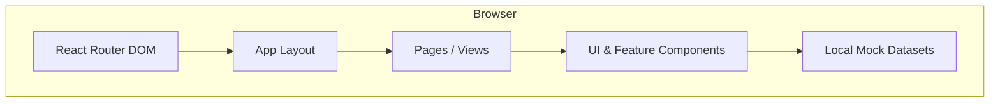
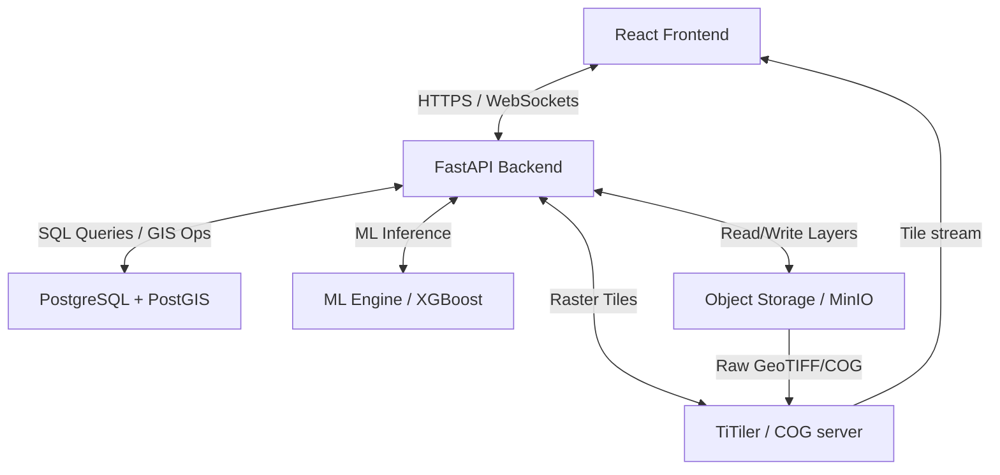

# Architecture: MANGAN-X

This document describes the design patterns, components, data flow, and external systems currently in use or planned for MANGAN-X.

## Current Frontend Architecture
MANGAN-X is built as a client-side Single-Page Application (SPA). The application renders entirely in the user's web browser, pulling resources from a static directory compiled via Vite.

## Component Structure
The folder organization separates visual representations from configurations:
- **Layout Shell**: Enforces uniform spacing, navigation headers, and active state triggers (`Sidebar`, `TopBar`, `AppLayout`).
- **Feature Components**: Encapsulates mining domain visualizations. For example, `MineMapSVG` provides visual layout mapping of drill collars, dump trucks, and ore boundaries using inline SVG graphics.
- **UI Toolkit**: Relies on `@/components/ui/` primitives (e.g., Dialog, Sheet, Button, Progress, Slider, Tabs) configured via Tailwind styling directives.
- **Data Repositories**: Contained in `@/data/`, hosting analytical matrices and mathematical simulations (e.g., forecasting formulas in `simulatorData.ts`).

## Data Flow
All state management operates through React hooks.
- **Read Operations**: Views directly import static constants (e.g., `GEOLOGICAL_ZONES`, `RISK_ITEMS`) and map over arrays to generate list elements or Recharts datasets.
- **Interactive Mutations**: Components like `Simulator` alter local view-states (`useState`) representing machinery inputs or weather conditions. Modifying a slider updates state values, which feed into a local formula (`calculateSimulatorOutputs`) to trigger recalculations of projected tonnage.
- **Notifications**: Triggered via `toast()` hooks from `sonner` and `@/components/ui/toaster`.

## Current External Services
None. The application operates in complete isolation, running entirely client-side. Supabase, Generative AI, and Leaflet dependencies in `package.json` are inactive.

---

## Future Architecture (FUTURE)
To transition from a static simulation mockup to a real-time production system, the following multi-tier architecture is proposed.

### Future Architecture Components
1. **React Frontend**:
   - Transition maps from custom canvas/SVG implementations to a Leaflet-based map client (`react-leaflet`).
   - Connect state to FastAPI endpoints using `@tanstack/react-query` for server synchronization and auto-polling.
2. **FastAPI Backend**:
   - Provide REST APIs for telemetry updates, simulation processing, and data exports.
   - Stream webhooks/WebSockets for equipment telemetry and sensor alerts.
3. **PostgreSQL/PostGIS Database**:
   - Store tabular datasets (mine telemetry, assay records, operational constraints).
   - Use PostGIS spatial columns (`geometry` / `geography`) to model drill collar coordinates, lease boundaries, and haul road linestrings for spatial intersections.
4. **Object Storage**:
   - Host large geospatial files (Sentinel/Landsat imagery bands, raw DEM rasters, vector Shapefiles).
5. **GeoTIFF/COG & Tile Serving**:
   - Convert large satellite files into Cloud Optimized GeoTIFF (COG) format.
   - Use a lightweight raster-tile server (e.g., TiTiler) to serve interactive XYZ tiles directly to Leaflet map layers.
6. **ML/GIS Processing Engine**:
   - ML inference script executing prospectivity modeling (XGBoost/Random Forest using spectral and spatial attributes).
   - Production gap time-series regression.
